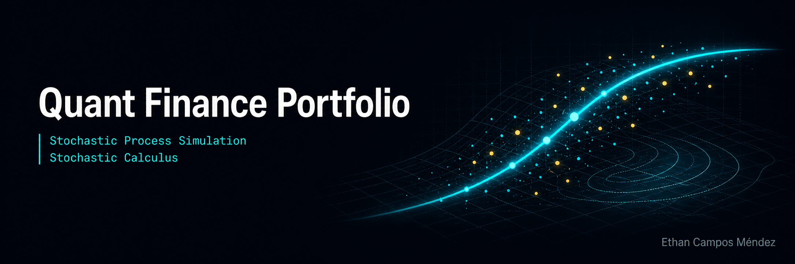

# Quant Finance Portfolio

## Overview

This repository is my working space for building a profound understanding of Quantitative Finance — from the mathematical foundations to fully implemented projects. It bridges my background in theoretical physics with the modelling tools used in modern quantitative research and derivatives pricing.

The repo is organised into two parts: **Notes** (notebooks covering the theory) and **Projects** (implementations with real or simulated market data).

---

## 📓 Notes

Self-contained Jupyter notebooks covering the core mathematical and financial 
theory.

| Topic | Description |
|---|---|
| **Stochastic Calculus** | Brownian motion, Itô's lemma, SDEs, Euler-Maruyama scheme |
| **Derivatives Pricing** | Black-Scholes derivation, risk-neutral pricing, put-call parity |
| **Probability & Statistics** | Measure theory basics, martingales, change of measure |
| **Basic ML** | Regression, classification, and neural networks applied to finance |
| **Finance History** | Key models, crises, and the evolution of quantitative finance |

---

## 🚀 Project Showcase

End-to-end implementations connecting stochastic theory to practical pricing and simulation tools.

### 📈 Geometric Brownian Motion Simulator
Simulate stock price trajectories using GBM — the stochastic process underlying Black-Scholes. Visualise path ensembles and study how drift and volatility parameters shape the distribution of outcomes.  
> *Physics connection: GBM is the financial analogue of a Brownian particle in a fluid under a constant drift force.*

### 🧮 Black-Scholes Analytical Pricer
Closed-form pricing of European call and put options with full Greeks computation (Δ, Γ, ν, θ, ρ). Includes interactive visualisations of how option price and sensitivity vary with spot price, volatility, and time to expiry.

### 🎲 Monte Carlo Options Pricing
Price European and path-dependent exotic options by simulating thousands of underlying price paths. Demonstrates convergence behaviour and variance reduction techniques (antithetic variates, control variates).

### 🌀 Heston Stochastic Volatility Model
Extends GBM by modelling volatility itself as a mean-reverting stochastic process (CIR dynamics). Reproduces the volatility smile observed in real options markets — something Black-Scholes cannot capture.  
> *Physics connection: The mean-reverting volatility process is formally equivalent to a noisy harmonic oscillator.*

---

## About

I'm a PhD student in Physics at the University of Southampton, specialising in open quantum systems and quantum foundations. I'm transitioning into quantitative research, and this repository documents that journey — applying the mathematical tools from theoretical physics (stochastic differential  equations, path integrals, perturbation theory) to financial modelling.

If you're a physicist curious about finance, or a quant curious about physics, this repo is for you.

---

## 🔗 Connect

Feedback, collaboration, and discussion always welcome:
 

Visit my Substack for some science communication:

Read my work as a Physicist:

**Thanks for visiting!!!**
